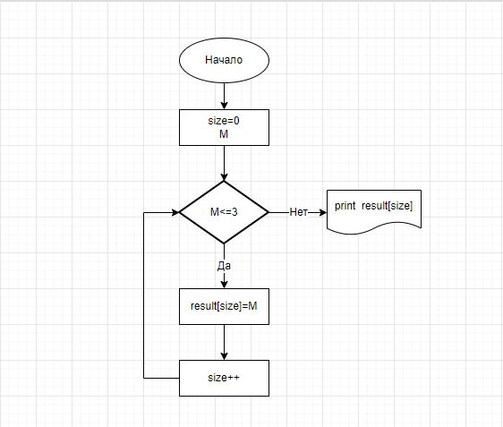

# Итоговая проверочная работа
### Описание решения задачи
1. Составление блок схемы

2. Введение данных
3. С помощью цикла *foreach* выполнили интерацию по интерируемому объекту
4. Через цикл *for* проверили массив строк
5. Если длина массива 3 и менее символа, вывели в консоль
6. Создали реппозитори на сайте [github](https://github.com/)
7. Загрузили папку в реппозиторий